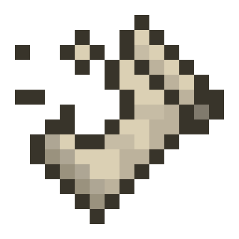

<!-- modrinth_exclude.start -->

# Spice of Fabric

[![modrinth downloads](https://img.shields.io/modrinth/dt/spice-of-fabric?color=30b27b&logo=data%3Aimage%2Fpng%3Bbase64%2CiVBORw0KGgoAAAANSUhEUgAAADAAAAAwCAYAAABXAvmHAAAACXBIWXMAAAAAAAAAAQCEeRdzAAAFjElEQVR4nO2aaYhWVRjH3WpcinS0tHIMW0gM7CmXsLQFCnOBFq0PmS2klpZmSraYYFNEC7SZBYqipfWhSAyKVo0RTC1JCwn6kJW0ueWSWuOo%2Ff%2Bc5zLnPe%2B595773vvOfKgXfjBw733Oc855tvOcadPm%2F1%2F8T96b05a0th6pPyjZEZwDrgXTwDNgEXgDLAWvgLlgAhgCeoB2ra10B9AfPADeBz%2BDv8HxBI6CvWAzeBWMAbWtofhQXeFfwLEUpZM4DNaBKeC0llD%2BbPAS2Jmg1BGwD%2FwGtuskd6fsDr%2F5AowFNdVQvD24AXzjGZw78Af4EMxTJWjn5%2BuEzwUCRoDpYDn4XpV2ZR0AC8CZRSrfCTwE%2FvTY87dgDhhAR86wGHXgNvAROORZkDXgwiKU7yImorjbT9N4NO9K4fuTwM1gvS6IPQZ3e2ge4TXgSdDorA5XbbAUGN8h6wzwPPjLmQR3%2BOJKhU51tpc2u7Ba0QJyTwR3ewJEA%2BiTVdjl4FdLSBOYD06uhvLWuMzc48EuZxKLQn2MQrqDTx0BK0DXCpWiKXYLNTmdBPPCQWt8WsL40AGn64pHH38J%2BmZU%2BgRwHrgLrFQzuDTD9zW64%2FYifkVfSfuwTkpj%2FX5wXeCgzNB9NTy%2BJaa0sBfiO3BVhkn0AZucADIz7aN7pbQ0WEbnChisTh18m%2FgTVMSbkiHT4t3bwT%2FW95tigwgdFKy2Xt4DhgcMwlyxJEHpCE4uU1zH%2B7VgrSWDkxkX9zILNDvbrkrzfHW4Wc4q%2BaApTsiivDXGDEcWF6u8FKd9icmGTWoGkwKEjwQ7UpSnvKfo2BVOYLBaQyRvK%2Bjle5EFFwuxG%2Bm44NQUwSzWNicozkX4WhemohCs4zAEb3B287JK5UVCu4J3EpT%2FCUwEPXMN1DzeAkf%2BnXmEMVzWS2mIdO391gzymDM6pbwz0Rnj8TwTqHW21IXVa4cAOTxHs2RZDJ6ThPCKZ6OdQPFaxRNQgfdLefkbJZspKd8y7F4P3pXmqMcT3JiEb66U0sKS%2BanyaphRAGyM2QHujjfZWObnO16uiXP2wiegQlnnNHoUadIdKhtAV9492UWws%2BGtdsV0L%2Byx8pmQCmXVui5GGdb07A911HdpNteIOaD43v8dDEsYizuw1ZpEfV7lmYHZxPohwZm55exgsDT%2BWO3c9x79Zl6SSeBZOzGntpvA62Cs76UrwH1iTmI8GfWOEUY7vkNKDzxxHBW%2Fs9uw1gnOFzp%2BeVYXkzFtwdM873QGjySsZlboD6NClU%2Bb2SVSWnOwz9PFek6bf1nS24dZeFECckboBNji%2BMwSzow6Qp%2BdBd5OMIeol9MQqDidnFVlXSHKW5OY6ijJXWAE%2BDzFznkCo5P11r99ZQYnuQ28AAZ57biACVAB%2B0jZKMl9UD5noVVryeimSkamxqp0i5hGGM%2FJ1W2rS%2FmhPg52DeptP7FksB35IPgETAKnZ9SBp8N7xITqbKW4%2BNsqLnt0orHnZTHhrnOmwZu%2Fe1hM8cZFYrKc4VuoJCFuY8uG7XI2n9pnVS5QefrhfmdMNgyytd2lvLV4XO16ctGK63jMMeyCuzmmoaJoJfHNXW7p1UXugJj7tSVSnmMYUC7KI5hF2NMewexdspvcL09UUX%2BbLKZQc001X3vdGoQRZbaUZuloN37UkDkcnCIBNbqYk1h%2Fdcz14i%2FJmXckt%2FLWoLxVYS2%2FJcax96ky83VFeZ3EayZ2OgaKSYa3gCfABxogfFmd9wO8vSzuismZCHufrF%2BSktsxNTlOipd7LNgOxigc0aQLME6qccnnTKLoa1beTrbMNatnIheIKcNpFts9zu6rm7gjbHixBGn5i%2B6YydAxeZ06SkyGflZK%2F9WAvvGYmATIViGjT%2Bv%2Bq0HILyQq%2Fed%2F%2FwIQ1cNLieDSBgAAAABJRU5ErkJggg%3D%3D&style=flat-square)](https://modrinth.com/mod/spice-of-fabric)

A Minecraft Fabric mod to spice up the way the food system works

Conceptually based on [Spice of Life](https://github.com/squeek502/SpiceOfLife) and [SoL: Carrot Edition](https://github.com/Cazsius/Spice-of-Life-Carrot-Edition)

<!-- modrinth_exclude.end -->

## About

Recent Minecraft versions added new methods of automating your food productions. But:

* Isn't it too easy to eat industrial Dried Kelp all the time?
* Aren't Hoglin farms just blatantly broken?
* Doesn't the game get boring if you only munch villager-traded Golden Carrots?

The solution is well known by now:

As you eat food, the nutrition value of the different kinds of food will decrease, so you're forced to have a diverse diet.

By default, the last 20 meals are considered when calculating the nutrition values and the drop in the nutrition will be pretty rapid.

If you're not a friend of that, then rest assured,
_all used formulas are totally configurable._
You can either edit the config file manually or use ModMenu to access the config screen.

## Carrot Mode

There's also the so-called "Carrot Mode" which is highly inspired by [Spice Of Life: Carrot Edition](https://minecraft.curseforge.com/projects/spice-of-life-carrot-edition)

For everyone who doesn't know the concept:

One starts with a lower than regular amount of hearts and through eating diverse foods you unlock more hearts.

_This too, is highly configurable._

## Food containers

Food containers are items that can hold multiple foods at once like a shulker, bundle or backpack.

They allow you to directly eat from the foods by right-clicking just like you would normally eat.

You can enable the following containers in the config:
- **Paper bag**: Is made from just paper and can store up to five stacks of food.
- **Lunch box**: Is made from planks and gold and can store up to nine stacks of food.
- **Picnic basket**: Is made from bamboo and can store up to nine stacks of food.

**Server-side-only installations can enable them by installing Polymer on the server and enabling the `use-polymer` configuration.**

## Translation status

Contribute or improve translations [here](https://weblate.siphalor.de/engage/spice-of-fabric).

## Dependencies

**This mod requires [Fabric API](https://modrinth.com/mod/fabric-api) to be installed separately.**  
If you want to use Food containers 

Contains Tweed API. Tweed redistributes [hjson-java](https://github.com/hjson/hjson-java) which is under the [MIT License](https://github.com/hjson/hjson-java/blob/master/LICENSE) currently copyrighted by Christian Zangl. This mod uses the [fork](https://github.com/PersonTheCat/hjson-java) made by [PersonTheCat](https://github.com/PersonTheCat).

This mod redistributes [exp4j](https://www.objecthunter.net/exp4j/) under the [Apache License 2.0](https://github.com/fasseg/exp4j/blob/master/LICENSE).

## License

This mod and its source code are available under the MIT license.
Feel free to learn from it and incorporate it in your own projects as long as you attribute me.
